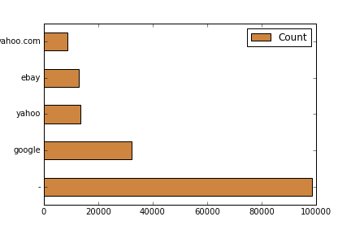
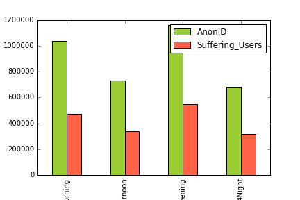
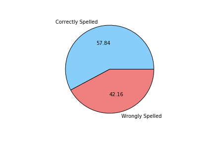
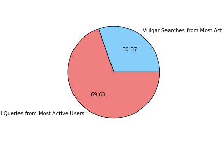
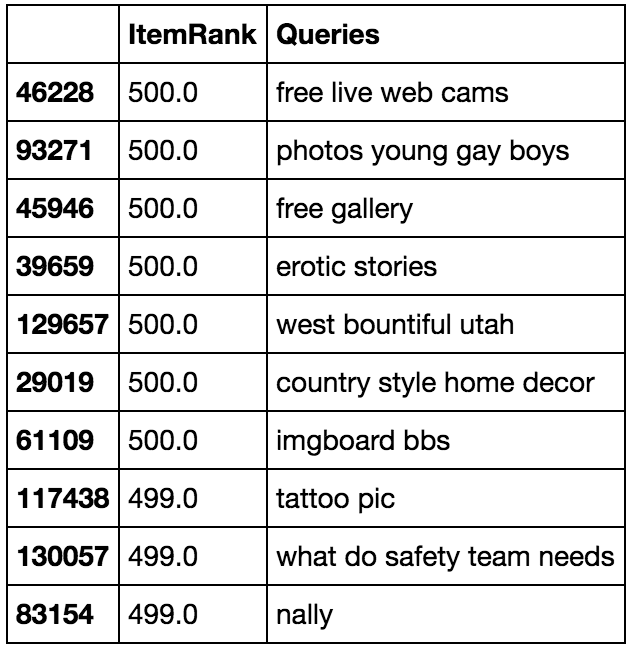
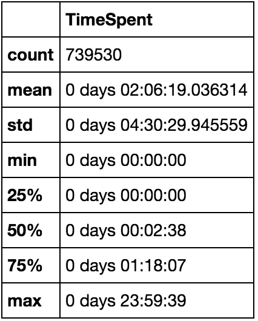
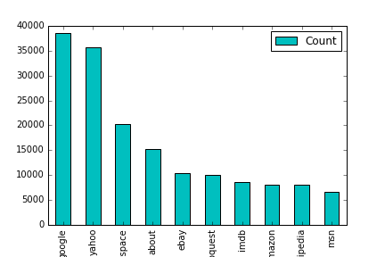

# AOL Exploratory Analysis
The goal of this collection is to provide real query log data that is based on real users. It could be used for personalization, query reformulation or other types of research.

## QUESTIONS

#### 1. EXPLORATORY ANALYSIS

##### a. What are some common queries ?
- To AOL's disappointment, it looks like most users were searching for other search engines instead of using AOL. This is evident when we look up the Common queries, they were either accidental (left blank, or accidentally hit search without typing a query, or they were searching for Google, Yahoo, etc)

##### b. Which queries do not typically lead to a click ?
- Mispelled and Vulgar searches
At first, I checked if there was a correlation between the time of day and the number of NaN results,and these were my findings.

But as seen above, there doesn't seem to be any indication that the time of the day is that big a factor to the number of NaN results. After determining who our most active users were and on taking a closer look at what they were searching for, it seemed to me that most of the queries had spelling errors, so I did a little analysis on the queries. 

As you can see, 42.2% of these NaN return searches are mispelled. The other 57.8% was correctly typed and yet there was no result. 
On reviewing this,I noticed a lot of x-rated material and these were my findings.

##### c. Which queries do not seem to have relevant results ? You should define this in your own terms and back it up with data.

Looking at the table above as well as the analysis; the following searches do not seem to have relevant results:
- X-Rated
- Misspelled
- Have Semantic errors 

##### d. How long are typical time spent by users on the search engine ? What does this distribution look like ?

##### e. What are the top urls that show up in results ?

##### f. What do you want to share with the Product Manager of Search based on exploratory analysis of this dataset ?

Opportunities:
- Targetting People Who Have Had No Problems With AOLs Search Engine Results so far
- Designing Market Retention Promotion Plans For First Time Users

Fixes:
- Incorporate an effective auto correction feature so that the queries lead to proper search results
- Look to implement better Semantic understanding of the Search Query and map it to a more fluent form so that the query can get better Item Ranks.
