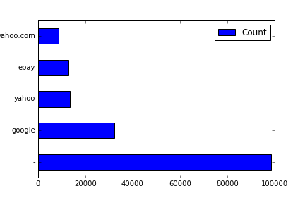
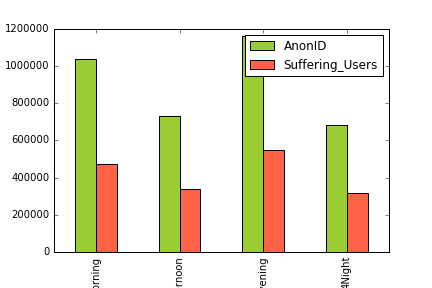
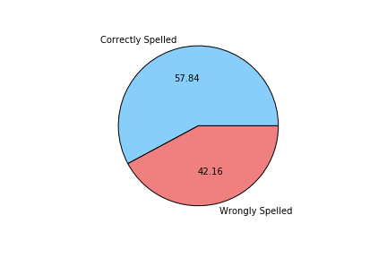
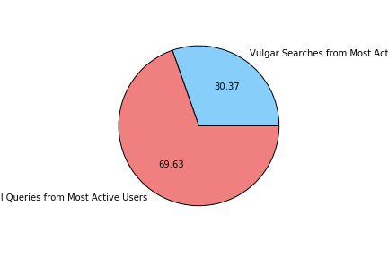
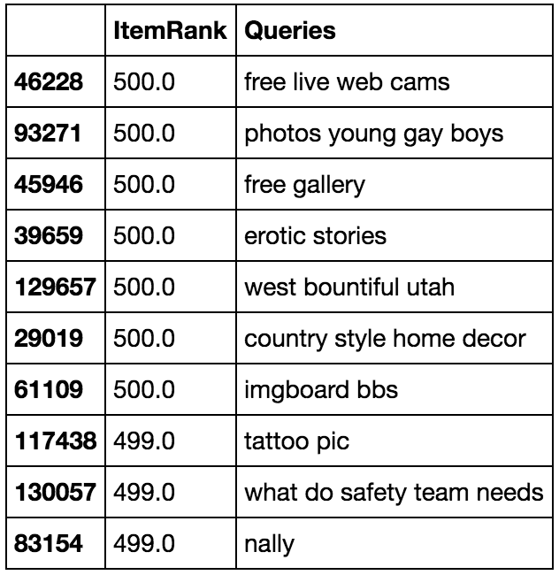
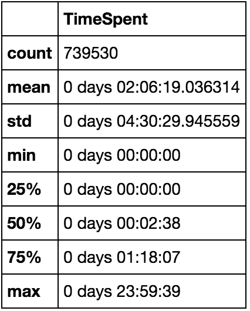
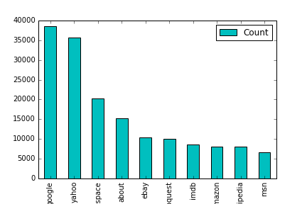

# AOL Exploratory Analysis
The goal of this collection is to provide real query log data that is based on real users. It could be used for personalization, query reformulation or other types of research.

## QUESTIONS

#### 1. EXPLORATORY ANALYSIS

##### a. What are some common queries ?
- Little to AOL's disappointment, it looks like most users are searching for other search engines instead of using AOL directly because when we look up the Common queries, they are either accidental (left blank, or accidentally hitting search without typing a query, or they are searching for Google, Yahoo, etc

##### b. Which queries do not typically lead to a click ?
- Mispelled and Vulgar searches
At first, I tried looking to see if there was a correlation between the time of day and the number of NaN results, and these were my findings.

But as we can see, there doesn't seem to be a big problem with respect to the time of day, so I dived deeper into what they were searching for. After finding out who our most active users were, I narrowed down to what they were searching for and I could see a lot of spelling errors, so I did a little analysis on the queries and I was right. 

As you can see, 42.2% of these NaN return searches are mispelled. But 57.8% is correctly typed, but no result still? 
Took a high-level view, and noticed a lot of x-rated material. So let's analyze that a bit!

##### c. Which queries do not seem to have relevant results ? You should define this in your own
terms and back it up with data.

Looking at the table below as well as the analysis; any searches that:
- X-Rated
- Misspelled
- Have Semantic errors 

##### d. How long are typical time spent by users on the search engine ? What does this distribution
look like ?

##### e. What are the top urls that show up in results ?

##### f. What do you want to share with the Product Manager of Search based on exploratory
analysis of this dataset ?

Opportunities:
- Targetting People Who Have Had No Problems With AOLs Search Engine Results
- Market Retention Promotion Plans For First Time Users

Fixes:
- Incorporate an effective auto correction feature so that the queries lead to proper search results
- Look to implement better Semantic understanding of the Search Query and map it to a more understandable form so that the query can get better Item Ranks.